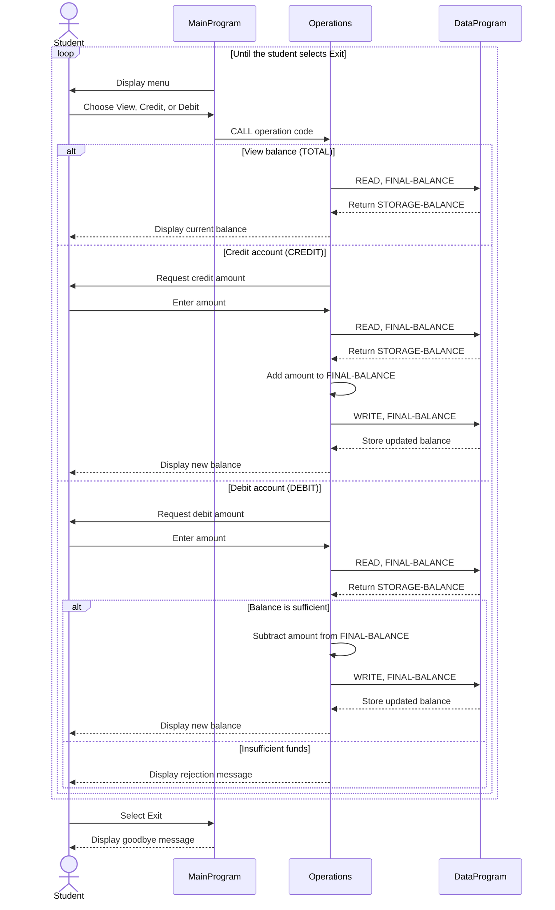

# Student Account COBOL Programs

This directory documents the COBOL implementation of a simple student account management system. The application runs as an interactive console program and keeps one account balance in memory while the program is running.

## Program Flow

`MainProgram` presents the menu and dispatches the selected action to `Operations`. `Operations` requests the current balance from `DataProgram`, applies a credit or debit when appropriate, and writes the updated balance back. `DataProgram` owns the stored balance and exposes the read/write interface used by `Operations`.

## COBOL Files

### `src/cobol/main.cob`

Program ID: `MainProgram`

Purpose:

- Runs the interactive account-management loop.
- Displays options to view the balance, credit the account, debit the account, or exit.
- Calls `Operations` with the six-character operation codes `TOTAL`, `CREDIT`, and `DEBIT`; `TOTAL` and `DEBIT` each include a trailing blank.
- Rejects menu selections other than 1 through 4 with an error message.

The loop continues until the user selects option 4.

### `src/cobol/operations.cob`

Program ID: `Operations`

Purpose:

- Implements account actions requested by `MainProgram`.
- Handles `TOTAL` by reading and displaying the current balance.
- Handles `CREDIT` by accepting an amount, adding it to the balance, and saving the result.
- Handles `DEBIT` by accepting an amount, checking available funds, subtracting it when allowed, and saving the result.
- Displays confirmation messages for successful credits and debits, or an insufficient-funds message when a debit is rejected.

`Operations` communicates with `DataProgram` using `READ` and `WRITE` requests and passes the balance as a parameter.

### `src/cobol/data.cob`

Program ID: `DataProgram`

Purpose:

- Owns the account balance in `STORAGE-BALANCE`.
- Returns the stored balance for a `READ` request.
- Replaces the stored balance for a `WRITE` request.
- Returns control to its caller with `GOBACK`.

The balance is held in working storage, so it is available to subsequent calls during the same program run but is not persisted to an external file or database.

## Student Account Business Rules

- The account starts with a balance of `1000.00`.
- A balance inquiry does not change the account balance.
- Credits increase the balance by the entered amount and are saved immediately.
- Debits are allowed only when the current balance is greater than or equal to the requested amount.
- A debit that exceeds the current balance is rejected and does not change the balance.
- Successful credits and debits display the resulting balance.
- There is one in-memory account; no student identifier or separate student records are modeled.
- The application does not save balances between runs.
- The source does not explicitly validate credit or debit amounts for zero, negative values, or invalid input. Amount handling follows the COBOL numeric definitions in the programs (`PIC 9(6)V99`).
- Menu operation codes are fixed-width six-character values. `TOTAL` and `DEBIT` each include a trailing blank in the value passed to `Operations`.

## Application Data Flow

